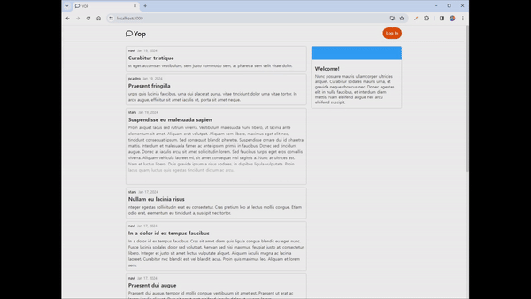
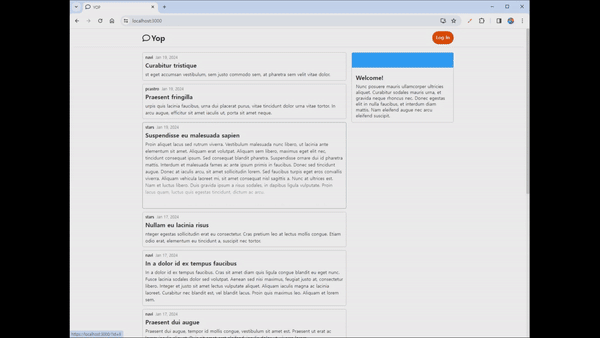
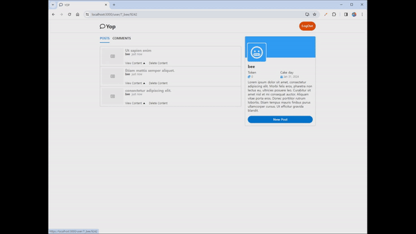

# Yop CLIENT

## 사용한 기술 스택 및 라이브러리

React, Javascript, CSS Module, Framer Motion, React Query, Redux

## 프로젝트 구성

├── public 
├── src 
├──── components 
├────── auth: 회원 가입, 로그인, 로그아웃 
├────── mypage: 마이페이지에 생성되는 My Post 등 관련 컴퍼넌트 
├────── post: 메인페이지에 생성되는 Post 관련 컴퍼넌트 
├────── profile: 우측에 생성되는 프로필 관련 컴퍼넌트 
├────── UI: 공통으로 사용되는 UI 컴퍼넌트 
├──── hooks : validation, popup 애니메이션 custom hooks 
├──── pages : Page 컴퍼넌트 
├──── store : Redux 를 이용해 state 관리 
├──── util : util 함수, http 요청 함수, validation 함수, socket 함수 
├─── App.js 
├─── index.css 
├─── index.js 
├─── Router.js 
└─ README.md 

## 기능 목록

### 메인 페이지

- 모든 유저의 포스트 목록 조회
- 포스트 클릭시 포스트의 내용 조회

### 회원 가입과 로그인

- 입력값의 유효성 검사와 오류시 애니메이션과 메세지 출력
- 로그인시 새로운 포스트 작성 기능

### 마이 페이지

- 유저의 활동을 조회 할 수 있는 페이지
- 유저가 쓴 글의 조회와 삭제

### 그 외 기능

- UI 컴포넌트 개발
- Framer motion 과 CSS 를 이용해 페이지 이동과 팝업 등의 액션에 애니메이션
- 미디어 쿼리를 이용해 반응형 웹 개발

## 설치

$ npm install 로 설치 후 $ npm start 로 실행
